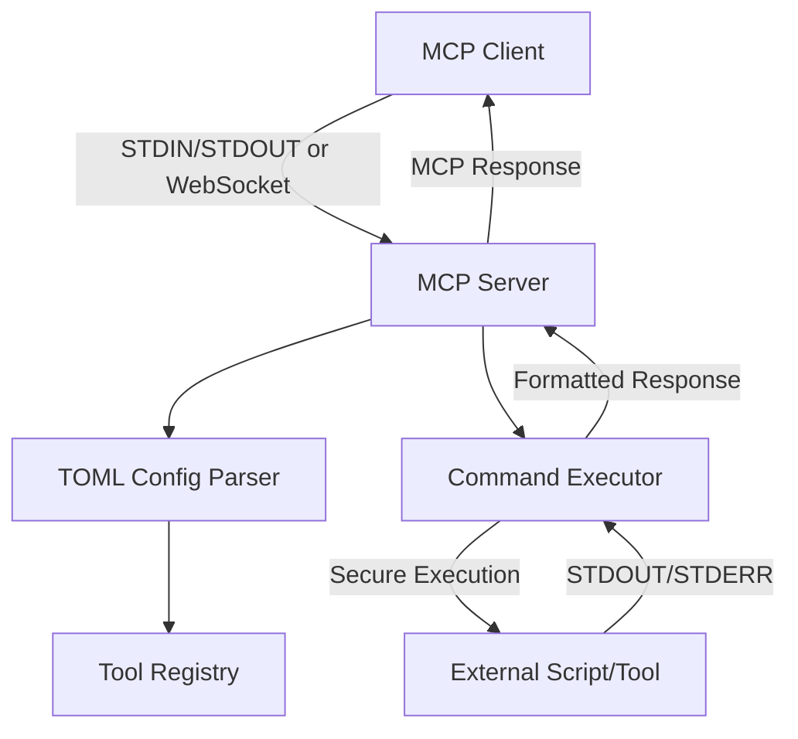

# Generic MCP Script Adapter - Implementation Plan

## Architecture Overview

This MCP server acts as a bridge between the Model Context Protocol and arbitrary command-line tools/scripts. It supports dual-mode operation (STDIN/STDOUT for VS Code integration, WebSocket for web services) and provides a flexible TOML-based configuration system.



## Project Structure

```
genmcp/
├── Cargo.toml
├── Dockerfile
├── README.md                 # Main project documentation
├── .cursorrules             # Development rules and specifications
├── docs/                    # Documentation directory
│   ├── configuration.md     # Complete configuration reference
│   ├── deployment.md        # Deployment guides (Docker, bare metal)
│   ├── architecture.md      # System architecture and design
│   └── development.md      # Development setup and contribution guide
├── src/
│   ├── main.rs              # Entry point, CLI parsing, mode selection
│   ├── config.rs            # TOML configuration parsing and validation
│   │   └── (may split into config/mod.rs + submodules if >1000 lines)
│   ├── config_schema.rs     # Configuration schema generation for LLM assistance
│   ├── server.rs            # MCP server implementation
│   │   └── (may split into server/mod.rs + server/handlers.rs + server/lifecycle.rs if >1000 lines)
│   ├── transport.rs         # STDIN/STDOUT and WebSocket transport handlers
│   │   └── (may split into transport/mod.rs + transport/stdio.rs + transport/websocket.rs if >1000 lines)
│   ├── executor.rs          # Secure command execution with timeouts
│   ├── tools.rs             # Tool registry and MCP tool definitions
│   └── error.rs             # Error types and handling
├── tests/
│   ├── common/
│   │   └── mod.rs           # Shared test utilities and helpers
│   ├── fixtures/            # Test configuration files and mock scripts
│   ├── integration/
│   │   ├── mcp_handshake.rs # End-to-end MCP initialization tests
│   │   ├── tool_execution.rs # End-to-end tool call tests
│   │   └── transport.rs     # Transport-specific integration tests
│   └── unit/                # Additional unit test modules if needed
└── examples/
    └── config.toml          # Example configuration file
```

## Implementation Details

### 1. Dependencies (`Cargo.toml`)

**Dependencies:**
- `rust-mcp-sdk = "0.7.4"` - MCP protocol implementation (provides server framework, lifecycle hooks, initialize/initialized handling)
- `rust-mcp-schema = "0.9.1"` - Type-safe MCP schema (defines protocol types, server info, capabilities)
- `rust-mcp-transport = "0.6.3"` - Transport layer (stdio support, message handling)
- `tokio = "1.0"` - Async runtime
- `axum = "0.7"` - Web framework for WebSocket server
- `axum-extra = "0.9"` - Additional Axum utilities
- `jsonwebtoken = "9.0"` - JWT token handling for authentication
- `tower-http = "0.5"` - HTTP middleware (for auth, CORS, etc.)
- `toml = "0.9.8"` - TOML parsing
- `clap = "4.5.53"` (or latest) - CLI argument parsing with subcommand support
- `serde = "1.0"` - Serialization for config
- `serde_json = "1.0"` - JSON handling
- `anyhow = "1.0"` - Error handling
- `thiserror = "1.0"` - Custom error types
- `nix = "0.27"` (or `libc`) - For sending Unix signals (SIGTERM, SIGINT, SIGKILL) on Unix platforms
- `tempfile = "3.0"` - For creating temporary files and directories in tests
- `tokio-test = "0.4"` - For async testing utilities

**Build Configuration:**

- Configure `[lints]` section to treat warnings as errors:
  ```toml
  [lints]
  rust = { level = "deny", warnings = "deny" }
  clippy = { level = "deny", warnings = "deny" }
  ```

- This ensures all compiler and clippy warnings are treated as errors
- Alternatively, add `#![deny(warnings)]` at the top of `src/main.rs`

### 2. Configuration Structure (`config.rs`)

TOML structure with nested groups:

```toml
[groups.group_name]
default_timeout = 30  # seconds, optional
default_timeout_max = 300  # seconds, optional (LLM cannot exceed)
default_stop_after = 0  # seconds, optional (0 = disabled). Allows processes like tail -f to run for N seconds then terminate gracefully
default_stop_after_max = 3600  # seconds, optional (LLM cannot exceed)
default_termination_signal = "SIGTERM"  # SIGTERM or SIGINT, optional (default: SIGTERM)
default_termination_grace_period = 5  # seconds to wait after signal before killing, optional
default_output_head_lines = 100  # optional
default_output_tail_lines = 100  # optional
default_output_head_lines_max = 1000  # optional (LLM cannot exceed)
default_output_tail_lines_max = 1000  # optional (LLM cannot exceed)
default_stderr_lines = 50  # optional
default_stderr_lines_max = 500  # optional (LLM cannot exceed)

  [[groups.group_name.tools]]
  name = "tool_base_name"  # Final tool name: "group_name_tool_base_name"
  description = "Tool description for LLM"
  command = "path/to/script.sh"  # or executable
  timeout = 60  # optional, overrides group default
  timeout_max = 600  # optional, overrides group default
  stop_after = 20  # optional, overrides group default (e.g., for tail -f to run 20s then stop)
  stop_after_max = 1800  # optional, overrides group default
  termination_signal = "SIGINT"  # optional, overrides group default (SIGTERM or SIGINT)
  termination_grace_period = 3  # optional, overrides group default (seconds to wait after signal)
  output_head_lines = 50  # optional, overrides group default
  output_tail_lines = 50  # optional, overrides group default
  output_head_lines_max = 500  # optional, overrides group default
  output_tail_lines_max = 500  # optional, overrides group default
  stderr_lines = 25  # optional, overrides group default
  stderr_lines_max = 250  # optional, overrides group default
  
    [groups.group_name.tools.parameters.param_name]
    description = "Parameter description"
    example = "example_value"
    required = true  # or false
    # Additional metadata can be added here
```

Key features:

- Groups provide defaults that tools inherit
- Tools can override group defaults
- MAX values prevent LLM from exceeding limits
- Tool descriptions automatically include MAX constraints when present
- Parameters are documented with descriptions and examples
- `stop_after` allows controlled duration execution (e.g., `tail -f` for 20 seconds) with graceful termination
- Termination signals (SIGTERM/SIGINT) and grace periods are configurable per tool/group

### 3. MCP Server Implementation (`server.rs`)

**MCP Protocol Compliance:**

- Use `rust-mcp-sdk` server framework with proper JSON-RPC 2.0 message handling
- Follow MCP specification for all lifecycle events and method implementations

**Initialization Lifecycle:**

1. **`initialize` method** (required):

   - Receive client's `initialize` request with protocol version, client capabilities, and implementation details
   - Validate protocol version compatibility
   - Respond with server capabilities including:
     - Protocol version
     - Server name: "genmcp" (or configurable)
     - Server version
     - Supported protocol features
     - Available tools (registered from TOML config)
     - Server implementation metadata
   - Load and validate TOML configuration during initialization
   - Register all tools from configuration

2. **`initialized` notification** (required):

   - Client sends `initialized` notification after successful `initialize` response
   - Server acknowledges and enters operational phase
   - Begin accepting tool calls and other requests

**Tool Registration:**

- Dynamically register tools from TOML config during initialization
- Tool names: `{group_name}_{tool_name}`
- Each tool schema includes:
  - Tool-specific parameters (from TOML with descriptions, examples, required flags)
  - Runtime overrides: `timeout`, `stop_after`, `output_head_lines`, `output_tail_lines`, `stderr_lines`
  - Runtime overrides are validated against MAX values
  - Tool descriptions automatically include MAX constraints when present
  - `stop_after` parameter allows LLM to specify duration for long-running processes (e.g., `tail -f`)

**Lifecycle Hooks:**

- **OnServerStart**: Load configuration, validate TOML file, initialize tool registry
- **OnServerStop**: Graceful shutdown, cleanup resources
- **OnSessionStart**: Per-client session initialization (if needed)
- **OnSessionEnd**: Per-client session cleanup (if needed)
- **Shutdown handling**: Implement `shutdown` method to gracefully terminate connections

**Capability Advertisement:**

- Advertise all available tools in server capabilities during `initialize`
- Tools must be fully registered before responding to `initialize`
- Support MCP protocol version negotiation

### 4. Transport Layer (`transport.rs`)

**MCP Transport Compliance:**

- All transports must use JSON-RPC 2.0 message format
- Messages must be UTF-8 encoded
- Proper message delimiting per transport specification

- **STDIN/STDOUT mode** (default):
  - Use `rust-mcp-transport/stdio` feature
  - Read JSON-RPC messages from stdin (newline-delimited)
  - Write JSON-RPC messages to stdout (newline-delimited)
  - Messages must not contain embedded newlines
  - stderr available for logging/debugging
  - Follow MCP stdio transport specification exactly

- **WebSocket mode**:
  - Use `axum` web framework for WebSocket server
  - Use `axum::extract::ws::WebSocketUpgrade` for WebSocket upgrade handling
  - Accept connections on configurable port (default: 8080)
  - Handle JSON-RPC messages over WebSocket frames
  - Support multiple concurrent connections
  - Proper WebSocket frame handling (text frames for JSON-RPC)
  - Connection lifecycle management (connect, disconnect, error handling)
  - **Authentication**: Stub JWT Bearer token authentication
    - Extract `Authorization: Bearer <token>` header from HTTP upgrade request
    - Validate JWT token format (stub: always accept any token for now)
    - Reject connections without valid `Authorization: Bearer` header
    - Return HTTP 401 Unauthorized for authentication failures
    - Future: Implement proper JWT validation with:
      - Secret key verification (from `--jwt-secret` CLI option or config)
      - Token expiration checking
      - Token signature validation
      - Optional: Token claims validation (issuer, audience, etc.)

### 5. Command Execution (`executor.rs`)

Security measures:

- Use `std::process::Command` with explicit argument vector
- Never use shell execution (no `/bin/sh -c`)
- Proper escaping: each argument passed separately
- Validate command paths (optional: whitelist/restrictions)

Execution flow:

1. Parse tool parameters from MCP call
2. Validate runtime overrides against MAX values
3. Build command with arguments
4. Start process and capture STDOUT/STDERR streams
5. Handle `stop_after` timer if configured (runs concurrently)
6. Handle `timeout` timer (runs concurrently)
7. If `stop_after` expires: gracefully terminate, return success with output
8. If `timeout` expires: gracefully terminate, return timeout error
9. If process exits normally: check exit code
10. If non-zero exit: return error with last N lines of STDERR
11. Apply head/tail line limits to output
12. Return formatted result to MCP client

**Graceful Termination Process:**

Both `timeout` and `stop_after` use the same graceful termination sequence:

1. **Send termination signal** (SIGTERM or SIGINT, configurable):

   - Use `process.kill()` with appropriate signal on Unix
   - On Windows, use `TerminateProcess` (graceful termination not fully supported)
   - Signal type configurable per tool/group (default: SIGTERM)

2. **Wait for graceful shutdown**:

   - Wait for `termination_grace_period` seconds (configurable, default: 5s)
   - Monitor process to see if it exits cleanly

3. **Force kill if needed**:

   - If process still running after grace period, send SIGKILL (Unix) or force terminate (Windows)
   - This ensures hung processes are always terminated

**Stop After vs Timeout:**

- **`stop_after`**: Intended for long-running processes (e.g., `tail -f`) that should run for a specific duration then stop. Returns as **success** with accumulated output.
- **`timeout`**: Safety mechanism to prevent processes from running too long. Returns as **error** if exceeded.

Both use the same graceful termination process, but differ in how the result is reported to the LLM.

### 6. CLI Interface (`main.rs`)

Command-line arguments using `clap` (latest version):

**Server mode:**

- `--config <path>` - Path to TOML config file (required for server mode)
- `--mode <stdio|websocket>` - Transport mode (default: stdio)
- `--port <port>` - Port for WebSocket mode (default: 8080)
- `--host <host>` - Host for WebSocket mode (default: 0.0.0.0)
- `--jwt-secret <secret>` - JWT secret key for token validation (optional, stub accepts any token for now)

**Schema output mode:**

- `schema` subcommand - Outputs the configuration file schema
  - `--format <json|toml|markdown>` - Output format (default: json)
  - Outputs a JSON Schema or structured description of the TOML configuration format
  - Includes all fields, types, descriptions, defaults, and constraints
  - Allows LLMs to understand and generate valid configurations

### 6a. Configuration Schema Output (`config_schema.rs`)

The schema output feature provides LLMs with a complete understanding of the configuration format:

- **JSON Schema format**: Standard JSON Schema v7 that describes the TOML structure
  - Includes property definitions, types, descriptions, defaults
  - Documents all optional vs required fields
  - Describes nested structures (groups, tools, parameters)

- **TOML format**: Example TOML file with all fields commented and documented
  - Shows the structure with placeholder values
  - Includes inline comments explaining each field

- **Markdown format**: Human-readable documentation
  - Structured documentation of the configuration format
  - Examples and usage patterns

The schema includes:

- Group-level defaults (timeout, output limits, stderr lines) with MAX constraints
- Tool-level overrides and their relationship to group defaults
- Parameter definitions with descriptions, examples, and required flags
- All field types and constraints
- Documentation of how tool names are generated (`{group}_{tool}`)

### 6b. Example Configuration File (`examples/unixtools_config.toml`)

The example configuration file demonstrates real-world usage by configuring common Unix/shell commands organized into functional groups:

**File Operations Group:**

- `mv` - Move/rename files and directories
- `cp` - Copy files and directories
- `rm` - Remove files and directories (with safety parameters)

**Text Processing Group:**

- `grep` - Search text using patterns
- `rg` (ripgrep) - Fast text search tool
- `sed` - Stream editor for filtering and transforming text
- `awk` - Pattern scanning and text processing
- `wc` - Word, line, and byte count

**File Search Group:**

- `find` - Traditional file search
- `fd` - Modern alternative to find

Each tool configuration includes:

- Appropriate parameter definitions (e.g., `pattern`, `file`, `flags`, `directory`)
- Realistic timeout values (e.g., 30s for simple commands, 300s for searches)
- `stop_after` configuration for long-running commands (e.g., `tail -f` with 20s stop_after to monitor logs for a specific duration)
- Termination signal configuration (SIGTERM/SIGINT) and grace periods
- Output limits appropriate to command type (e.g., grep may return many lines, wc returns few)
- MAX constraints to prevent resource exhaustion
- Descriptions and examples that help LLMs understand proper usage
- Required vs optional parameter flags

The example serves as both a working configuration and a template for users to adapt for their own tools.

### 7. Docker Support

`Dockerfile`:

- Multi-stage build for smaller image
- Rust toolchain for building
- Runtime image with minimal dependencies
- Expose WebSocket port (configurable)
- Support both stdio and websocket modes via CMD/ENTRYPOINT

### 8. Documentation

**Documentation Requirements:**

- **Keep documentation up to date** - Update docs when making changes that affect:
  - User-facing behavior
  - Configuration format
  - CLI interface
  - API or protocol behavior
  - Installation or deployment procedures

**README.md** (Main project documentation):

- Project overview and purpose
- Quick start guide
- Installation instructions
- Basic usage examples
- Links to detailed documentation in `docs/`
- Table of contents for easy navigation

**docs/ directory** (Detailed documentation):

- `configuration.md` - Complete configuration reference
  - TOML structure and all fields
  - Group and tool configuration
  - Parameter definitions
  - Default inheritance rules
  - MAX value constraints
  - Examples for common scenarios

- `deployment.md` - Deployment guides
  - Docker deployment (multi-stage build, configuration)
  - Bare metal installation
  - STDIN/STDOUT mode setup (VS Code integration)
  - WebSocket mode setup (web service)
  - Environment variables and configuration

- `architecture.md` - System architecture
  - High-level architecture diagram
  - Component descriptions
  - Data flow
  - Design decisions and rationale
  - MCP protocol integration details

- `development.md` - Development guide
  - Development setup
  - Building from source
  - Running tests
  - Contribution guidelines
  - Code organization and module structure

**Documentation Standards:**

- Use clear, concise language
- Include code examples where helpful
- Keep examples up to date with actual code
- Use proper markdown formatting
- Include table of contents for longer documents
- Cross-reference related documentation
- Update documentation as part of cohesive chunks when making relevant changes

## Development Workflow

**Work in Cohesive Chunks:**

- Complete a logical unit of work before committing (e.g., implement a module, add tests, fix bugs)
- Each chunk should be self-contained and functional
- Avoid partial implementations that break the build
- Group related changes together (implementation + tests + documentation)
- Update documentation when making changes that affect user-facing behavior or configuration

**After Each Change:**

1. Run `cargo test` - Fix any failing tests (do not modify tests unless they are incorrect)
2. Run `cargo build` - Must pass with no warnings (warnings are treated as errors)
3. Run `cargo clippy -- -D warnings` - Must pass with no warnings (linter warnings are treated as errors)
4. Resolve all errors and warnings before proceeding to next change
5. Commit the cohesive chunk with a proper commit message

**Git Commit Strategy:**

- Commit after completing a cohesive chunk of work
- Use conventional commit messages with clear, descriptive messages
- Format: `<type>(<scope>): <subject>`
  - Types: `feat`, `fix`, `test`, `docs`, `refactor`, `chore`
  - Scope: module name or area (e.g., `config`, `executor`, `mcp-server`)
  - Subject: concise description of what changed
- Include body if needed for context or breaking changes
- Examples:
  - `feat(config): add TOML parsing with nested groups structure`
  - `test(executor): add unit tests for timeout and graceful termination`
  - `fix(transport): handle malformed JSON-RPC messages correctly`

**Test Modification Policy:**

- Tests define expected behavior - only modify tests if they are testing the wrong behavior
- If implementation changes, update tests only if the new behavior is correct
- Prefer fixing implementation to match tests over changing tests

**Warning Policy:**

- **All warnings are treated as errors** - the build must not produce any warnings
- Configure `Cargo.toml` to deny warnings at the crate level using `[lints]` section
- Use `cargo clippy -- -D warnings` to treat clippy warnings as errors
- Only disable warnings with `#[allow(...)]` or `#[allow(clippy::...)]` when there's a solid technical reason
- Always document the reason: `#[allow(warning_name)] // Reason: ...`
- Common valid reasons: API compatibility, performance requirements, external interface constraints

**Build Configuration:**

- Add to `Cargo.toml`:
  ```toml
  [lints]
  rust = { level = "deny", warnings = "deny" }
  clippy = { level = "deny", warnings = "deny" }
  ```

- Alternatively, add `#![deny(warnings)]` at the top of `src/lib.rs` or `src/main.rs`
- Ensure CI/build scripts use `cargo clippy -- -D warnings`

**Modularization Guidelines:**

- **Proper design takes precedence over arbitrary limits**
- Aim to keep individual source files under 1000 lines when possible
- Split large modules into submodules when it improves organization and maintainability
- Use Rust's module system (`mod` declarations) to organize related functionality
- Create submodules for:
  - Distinct functional areas within a module (e.g., `server/handlers.rs`, `server/lifecycle.rs`)
  - Complex types and their implementations
  - Separate concerns (e.g., parsing vs validation, different transport types)
- Example structure if modules grow:
  - `config/mod.rs` + `config/parser.rs` + `config/validator.rs`
  - `server/mod.rs` + `server/handlers.rs` + `server/lifecycle.rs`
  - `transport/mod.rs` + `transport/stdio.rs` + `transport/websocket.rs`
- Balance: Don't over-modularize - keep related code together when it makes sense
- Each module should have a clear, single responsibility

## Key Implementation Points

1. **MCP Protocol Compliance**: 
   - Proper `initialize` method implementation with capability negotiation
   - Handle `initialized` notification from client
   - Advertise server capabilities (name, version, protocol version, tools)
   - Implement `shutdown` method for graceful termination
   - All messages follow JSON-RPC 2.0 specification
   - UTF-8 encoding and proper message delimiting per transport

2. **Tool Name Generation**: `{group_name}_{tool_name}` ensures unique, namespaced tools
3. **Default Inheritance**: Tools inherit from group, can override, LLM can override (within MAX)
4. **Security**: No shell execution, explicit argument vectors, path validation
5. **Error Reporting**: Non-zero exits return last N lines of STDERR (configurable)
6. **Output Management**: Head/tail line limits applied to STDOUT, configurable per tool/group
7. **MAX Enforcement**: Runtime overrides validated against MAX values, errors returned if exceeded
8. **Documentation**: Tool descriptions automatically include MAX constraints in MCP tool schema
9. **Schema Generation**: `schema` subcommand outputs configuration schema in multiple formats (JSON Schema, TOML example, Markdown) to assist LLMs in generating valid configurations
10. **Lifecycle Management**: Proper server startup, session management, and graceful shutdown hooks
11. **Stop After Feature**: Configurable `stop_after` allows processes to run for a specified duration then terminate gracefully (e.g., `tail -f` for 20s). Returns as success, not error.
12. **Graceful Termination**: Both `timeout` and `stop_after` use graceful termination (SIGTERM/SIGINT) with configurable grace period before force kill (SIGKILL). Signal type configurable per tool/group.
13. **Modularization**: Proper design takes precedence over arbitrary limits. Aim for files under 1000 lines, but split into submodules only when it improves organization. Use Rust's module system to organize related functionality logically.
14. **Documentation**: Documentation must be kept up to date. Main documentation in README.md, detailed docs in docs/ directory. Update docs when making changes that affect user-facing behavior, configuration, or deployment.
15. **Web Framework**: Use Axum for WebSocket server implementation. Provides modern async web framework with built-in WebSocket support via `axum::extract::ws::WebSocketUpgrade`.
16. **Authentication**: Stub JWT Bearer token authentication for WebSocket mode. Extract token from `Authorization` header, validate (stub accepts any token for now), reject connections without valid Bearer token. Future: implement proper JWT validation.

## Testing Strategy

**Unit Tests (comprehensive coverage with edge cases):**

Each module should have corresponding test modules in `src/*/tests.rs` or `tests/*.rs`:

1. **Config Parsing (`config.rs` tests)**:
   - Valid TOML parsing with all fields
   - Missing optional fields (should use defaults)
   - Invalid TOML syntax
   - Invalid field types
   - Missing required fields (should error)
   - Nested group structure parsing
   - Tool parameter definitions
   - Default inheritance (group → tool)
   - MAX value validation
   - Edge cases: empty groups, empty tool lists, malformed parameter definitions

2. **Command Execution (`executor.rs` tests)**:
   - Successful command execution
   - Command with arguments (proper escaping)
   - Command with special characters in arguments
   - Non-zero exit code handling
   - STDERR capture and reporting
   - STDOUT capture
   - Timeout handling (process killed after timeout)
   - Timeout graceful termination (SIGTERM/SIGINT → SIGKILL)
   - `stop_after` feature (process runs for duration, then terminates gracefully)
   - `stop_after` returns success (not error) with output
   - Output line limiting (head/tail)
   - Empty output handling
   - Very long output handling
   - Signal handling on Unix (SIGTERM, SIGINT, SIGKILL)
   - Process that ignores signals (should be force killed)
   - Edge cases: missing executable, permission denied, invalid arguments

3. **Tool Registry (`tools.rs` tests)**:
   - Tool name generation (`{group}_{tool}`)
   - Tool schema generation from config
   - Parameter schema generation
   - MAX constraint inclusion in descriptions
   - Runtime override validation
   - MAX value enforcement (should reject overrides exceeding MAX)
   - Edge cases: duplicate tool names, empty parameter lists, missing descriptions

4. **MCP Server (`server.rs` tests)**:
   - `initialize` method with capability negotiation
   - Protocol version validation
   - Server capability advertisement
   - Tool registration during initialization
   - `initialized` notification handling
   - Tool call handling
   - Runtime override validation in tool calls
   - Error response formatting
   - `shutdown` method
   - Edge cases: invalid protocol version, missing capabilities, malformed requests

5. **Transport Layer (`transport.rs` tests)**:
   - STDIN/STDOUT message parsing (newline-delimited)
   - STDIN/STDOUT message formatting
   - WebSocket frame handling (via Axum)
   - WebSocket connection lifecycle
   - JWT Bearer token authentication (stub validation)
   - Authentication header extraction
   - Rejection of connections without valid Bearer token
   - JSON-RPC 2.0 message format compliance
   - UTF-8 encoding validation
   - Edge cases: malformed JSON, incomplete messages, connection drops, invalid tokens

6. **Config Schema (`config_schema.rs` tests)**:
   - JSON Schema generation
   - TOML example generation
   - Markdown documentation generation
   - Schema completeness (all fields included)
   - Schema accuracy (matches actual config structure)

7. **CLI Interface (`main.rs` tests)**:
   - Argument parsing (all options)
   - Config file path validation
   - Mode selection (stdio/websocket)
   - Port/host validation
   - Schema subcommand
   - Schema format selection
   - Edge cases: missing required args, invalid values, file not found

**Integration Tests:**

- End-to-end tool execution through MCP server
- Full initialization handshake
- Tool call with all parameter types
- Error propagation from executor to MCP client
- Multiple concurrent tool calls
- Transport-specific integration tests (stdio and websocket)

**Test Organization:**

- Unit tests: `#[cfg(test)] mod tests { ... }` in each source file
- Integration tests: `tests/` directory with separate test files
- Test utilities: `tests/common/mod.rs` for shared test helpers
- Mock/fixture data: `tests/fixtures/` for sample configs and test scripts

**Clippy Configuration:**

- Use default clippy settings (no unnecessary suppressions)
- Document any `#[allow(clippy::...)]` with comments explaining why
- Example: `#[allow(clippy::too_many_arguments)] // Required for MCP tool call signature compatibility`

